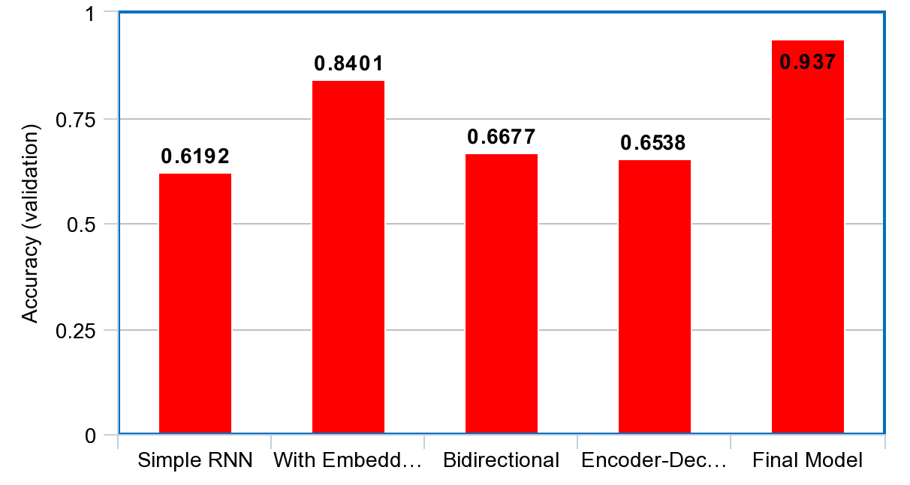

# English to French

> This project experiments with many different RNN models. Therefore it acts as an ending to my NLP review session

Built a deep neural network that functions as part of an end-to-end machine translation pipeline. The final model takes in English sentences and translates them into French. Although each model only takes <10 minutes to finish training, I did experiment with 5 models. Therefore, a GPU-enabled computing environment would be favored. This project was particularly enjoyable because I got to see the difference each breakthrough in data-based-approach for NLP made on the model performances. 

---

## Data

The dataset I used is a small subset of [WMT](https://www.statmt.org/wmt10/translation-task.html) (workshop on statistical machine translation) included in this directory. It has 1823250 english words (227 unique) and 1961295 french words (355 unique). As usual, I tokenized the texts, obtained the sequences, and padded them (post). 

---

## Models

All performances measured after 10 epochs of training (validation set). Parameter numbers only include the trainable ones. Note that all layers except the second use embeddings, which proved to increase the accuracy by a huge margin.

> The final model is contains an encoder with embedding layers and bidirectional GRU then a decoder with bidirectional GRU. It achieved an accuracy of 93.7% in just 10 epochs with a small dataset.

<table style="width:100%" align="center" valign="center">
	<tr>
    <th></th>
		<th>Simple RNN</th>
		<th>With Embedding</th>
		<th>Bidirectional</th>
		<th>Encoder-Decoder</th>
		<th>Final Model</th>
  </tr>
  <tr>
    <th>Parameter Number</th>
    <th>9017</th>
    <th>14499</th>
    <th>17733</th>
    <th>147458</th>
    <th>301163</th>
  </tr>
  <tr>
    <th>Time per Epoch</th>
    <th>6-7s</th>
    <th>7-8s</th>
    <th>9-11s</th>
    <th>12-13s</th>
    <th>20-21s</th>
  </tr>
  <tr>
    <th>Accuracy</th>
    <th>0.6192</th>
    <th>0.8401</th>
    <th>0.6677</th>
    <th>0.6538</th>
    <th>0.9370</th>
  </tr>
</table>

---

## Performance Comparison

Word embedding alone boosted a simple GRU RNN's accuracy by ~36%. Then the addition of bidirectional and encoder-decoder model components further increased the accuracy by ~12%.

## Performance Improvements

- Increase epoch number (only trained each model for less than 10 minutes)
- Increase training data (only used a fraction of WMT)
- We need to go deeper by adding more hidden layers
- Use more up-to-date techniques, like in [this repo](https://github.com/Jacklu0831/Image-Captioning) of mine

## Requirements

- Python 3
- NumPy
- TensorFlow 1.x
- Keras 2.x
- Jupyter notebook